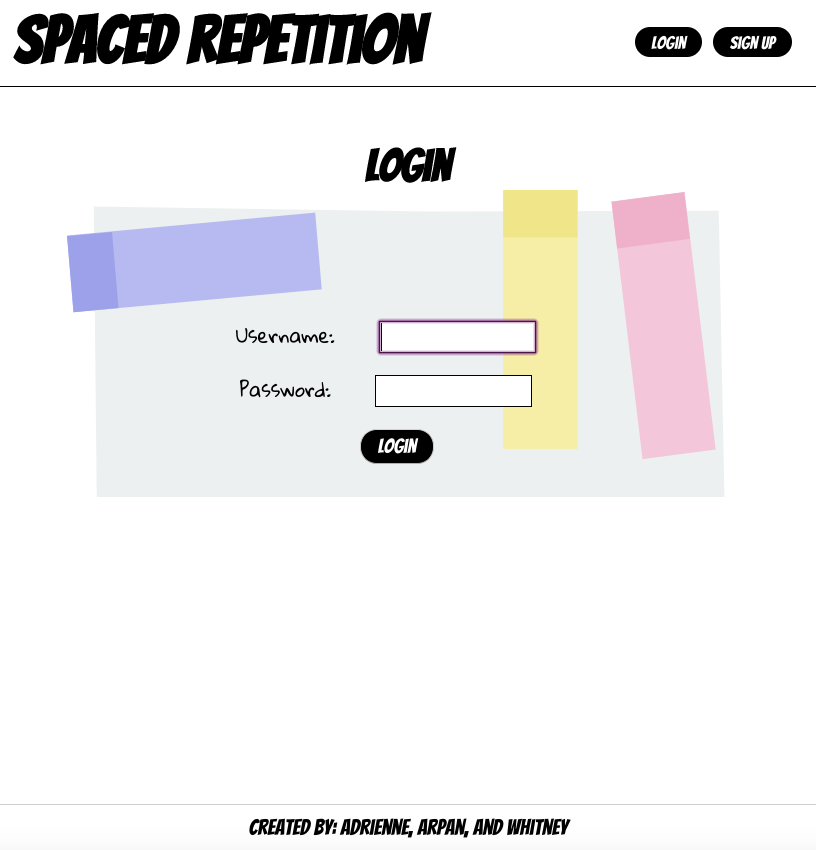
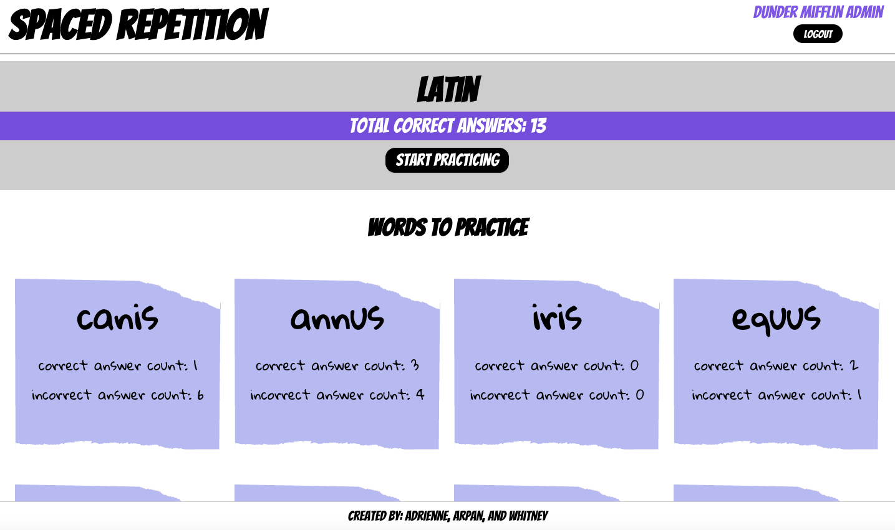

# SPACED REPETITION CAPSTONE 
#### ADRIENNE, ARPAN, AND WHITNEY

## Summary

Our app helps users learn 10 Latin words with the use of our spaced repetition algorithm.

Live Link: [Spaced Repetition Capstone]()

## Screenshots
- Log In

- Sign Up

- Dashboard

- Learning Page

- Correct Answer

- Incorrect Answer

- 404 Page


## API Documentation
`/api/auth/token`
  * POST -> requires {username, password} and checks username and password, and creates JWT
  * PUT -> requires {username} and creates JWT

`/api/language`
  * GET -> gets all words in the list

`/api/head`
  * GET -> gets the next word, total score, correct and incorrect count for current word

`/api/guess`
  * POST -> requires {guess} and return next word, total score, correct and incorrect count for current word, the answer, and if the guess is correct or not

`/api/user`
  * POST -> requires {password, username, name} and adds user to database


## Technology/Frameworks Used:

* HTML
* CSS (Flexbox & Media Queries)
* JavaScript
* React
* Express
* Node.js
* Zeit
* Heroku
* Git
* GitHub
* Visual Studio Code
* Postman

## Installation:

### [Spaced Repetition Server]()
* Install dependencies: `npm install`

* If using user `dunder-mifflin`:

```bash
mv example.env .env
createdb -U dunder-mifflin spaced-repetition
createdb -U dunder-mifflin spaced-repetition-test
```

* If your `dunder-mifflin` user has a password be sure to set it in `.env` for all appropriate fields. Or if using a different user, update appropriately.

```bash
npm install
npm run migrate
env MIGRATION_DB_NAME=spaced-repetition-test npm run migrate
```

* And `npm test` should work at this point

## Configuring Postgres

* For tests involving time to run properly, configure your Postgres database to run in the UTC timezone.

1. Locate the `postgresql.conf` file for your Postgres installation.
   1. E.g. for an OS X, Homebrew install: `/usr/local/var/postgres/postgresql.conf`
   2. E.g. on Windows, _maybe_: `C:\Program Files\PostgreSQL\11.2\data\postgresql.conf`
   3. E.g  on Ubuntu 18.04 probably: '/etc/postgresql/10/main/postgresql.conf'
2. Find the `timezone` line and set it to `UTC`:


* Start server with `npm start` or `npm run dev`

### [Spaced Repetition Client]()
* Install dependencies: `npm install`
* Start app with `npm start`

## Credits:
Created by Adrienne, Arpan, and Whitney

